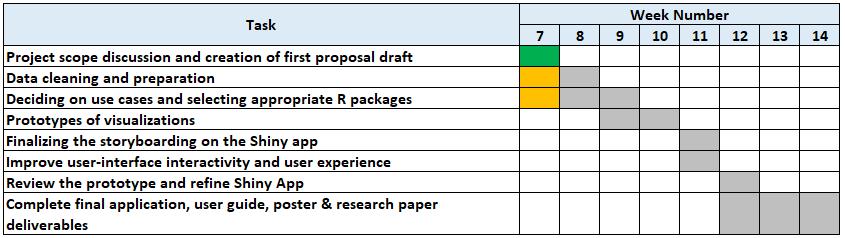

```{r setup, include=FALSE}
knitr::opts_chunk$set(echo = FALSE,
                      message = FALSE,
                      warning = FALSE)
```

```{r}
packages <- c('distill')

for (p in packages) {
  if(!require(p, character.only = T)) {
    install.packages(p)
  }
  library(p, character.only = T)
}
```

# 1. Context

In the roughly twenty years that Tethys-based GAStech has been operating a natural gas production site in the island country of Kronos, it has produced remarkable profits and developed strong relationships with the government of Kronos. However, GAStech has not been as successful in demonstrating environmental stewardship.

In January, 2014, the leaders of GAStech are celebrating their new-found fortune as a result of the initial public offering of their very successful company. In the midst of this celebration, several employees of GAStech go missing. An organization known as the Protectors of Kronos (POK) is suspected in the disappearance, but things may not be what they seem.

As experts in visual analytics, our group are called in to help the law enforcement from Kronos and Tethys.

***

# 2. Dataset Overview

Our team is working on the **[VAST Challenge 2021 Mini-Challenge 1 Dataset](https://www.vast-challenge.github.io/2021/MC1.html)**.

The dataset includes current and historical news reports, resumes of numerous GAStech employees, organization chart and two weeks of email headers to come up with the visualizations among all of these people and organizations. 

***

# 3. Motivations and Objectives
Our team aims to build a web visual analytics driven application that can help law enforcers detect anomalies and visualize relationships and conditions among all the people and organizations related to the kidnapped victims. This will help the law enforcers identify the link between various news sources, emails, events and activities to aid them in their detective work and solve the case.

Our analysis in the form of practice research paper on this website using Association for Computing Machinery (ACM)'s template of **[rticles for R Markdown](https://www.github.com/rstudio/rticles)** and the visualisations will be built on the ShinyApp using R to complement our analysis.

***

# 4. R Packages for our Analysis

R Package | Description
------------- | -------------
**[shiny](https://cran.r-project.org/web/packages/shiny/index.html)** | ‘shiny’ is an R package that allows easy development of interactive web apps. It allows various interactive features to enhance the user experience.
**[ggplot2](https://www.cran.r-project.org/web/packages/ggplot2/index.html)** | This package allows creation of graphs that represent both univariate and multivariate numerical and categorical data.
**[plotly](https://www.cran.r-project.org/web/packages/plotly/index.html)** | ‘plotly’ has an R graphing library which helps in creating interactive, high quality graphs for line plots, scatter plots, area charts, bar charts, error bars, etc.
**[tidyverse](https://www.cran.r-project.org/web/packages/tidyverse/index.html)** | It includes a variety of related packages for data manipulation and data visualization in R.
**[ggnetwork](https://www.cran.r-project.org/web/packages/ggnetwork/vignettes/ggnetwork.html)** | Network geometries to plot network objects with 'ggplot2', which is necessary for building network graph by ggplot.
**[visNetwork](https://www.cran.r-project.org/web/packages/visNetwork/index.html)** | visNetwork package allows the building of network visualizations to visualize complex relationships between different elements. Network visualization is technique used to visualize complex relationships between different elements. The directed and undirected graph structures establish the relationship between entities. Entities are displayed as round nodes and the lines represent the relationship between them.
**[igraph](https://cran.r-project.org/web/packages/igraph/index.html)** | igraph package is used for creating, manipulating and analyzing graph that is mainly utilized for network analysis and visualization.

***

# 5. Project Schedule



