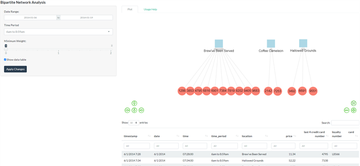
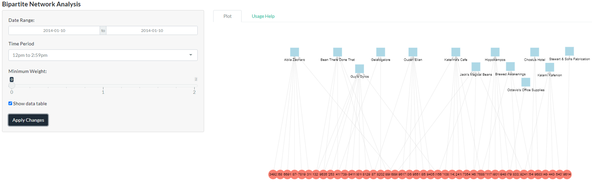

# Introduction 

With the pressing time urgency in solving crimes, it is necessary to maximize the use of analytics tools to enhance the law enforcers’ abilities to pick up hints and clues in order to speed up their investigation and to close the case. The R packages for data analytics provide an excellent tool for analysts to customize various visualizations according to the business use cases. The R packages share an underlying design philosophy, grammar, and data structures and this strong advantage allows analysts to combine various functionalities of different packages in an integrated manner.

# Motivation of the application

The motivation behind this application is driven by the need for an efficient end-to-end environment of data pre-processing, data visualization creation and analysis as well as to host the visualizations on a web browser for the end users’ convenient use, allowing them to perform further what-if analysis, manipulating parameters to see the impact of different approaches/perspectives without a coding background prerequisite. Shiny is an R package for developing interactive web applications and its benefits include ease-of-use, diversity, shareability and elegant design. It also makes development work more efficient especially since it has high reproducibility as end users can easily replicate or make tweaks with the source code. Shiny is also open source which reduces the barrier of entry for new users who would want access to a visualization tool that allows them to customize visualizations. 

Our research and development efforts for this Shiny application were motivated by the interactive and user-friendly web-enabled client-based visual analytics tool to aid in the identification of anomalies, suspicious behaviours and patterns. The Shiny web application built for the analysis is highly customisable and easy to use with user interactivity on visualizations. It aims to provide the law enforcement agencies in Kronos and Tethys with an analytic tool for discovering visual behaviours and patterns of the network relationships in emails, credit card transactions and car movement paths. Specifically, it supports the following analysis:

* To perform community visualization by creating a bipartite network analysis of the credit card transaction data to understand the relationship between the credit cards and the merchants.

*	To create visualizations on the stationary points using the vehicle tracking data to uncover the formal/informal relationships among the employees and to map the employees to their corresponding credit cards.

# Review and Critic on Past Work

## Review on Community Detection Network Visualization

There have been some existing network visualizations using R performed with the same GAStech employees’ email dataset but there are still room for improvement especially in utilizing or integrating more functionalities of R packages.

For the review on community detection network visualization (Figure 1) there was no label to indicate the identity of each node (employee) and no label to explain the meaning of the colors. On the other hand, Figure 2’s community detection network visualization contains labels which aid in the understanding of the identification of each node (employee) and a legend to explain the meaning of the colors. The edge link also retained their color after the node have been selected which could be confusing for users as there are too many lines that are not directly related to the nodes and nearest neighbors.

Both of the visualizations shown in Figure 1 and Figure 2 above did not provide other filter functions for the end users which would have otherwise allowed the end users more flexibility in zooming in on targeted analysis that they would like to perform.

## Review on Bipartite Network Visualization

A research paper by Seal & Wild @sealwild2018 looked at the visualization of network plots using Shiny application. The application had a module on the network properties of the bipartite network graph such as modes, density, compute centrality measures such as degree, density, betweenness of the nodes and total number of interactions (Figure 3). This is useful to the users to help understand the centrality measures that will aid in their decision making and the visualization of the bipartite network graph.

The application also contains a network plot module (Figure 4) using the visNetwork package. The true interactions are denoted by the bold lines while the predicted interactions are displayed in dashed lines with drop down lists provided to select specific nodes and groups. Although this network plot is useful to show the network, the layout of the network visualization could be further improved to better show the bipartite relationship of the data using the bipartite network layout since the dataset used is a two-projected (bipartite) network of drugs and proteins. In view of this problem, we research to explore alternative visualization methods to analyze the bipartite network data in our credit card transactions dataset which contains the credit card numbers and the locations. A good visualization method will be using the bipartite-specific layout of the igraph package (Figure 5) to better visualize and represent the network that makes it easier to understand and incorporating features to draw interest.

## Review on Movement Path Visualization

Youssef et al. @youssefetal2019 utilizes the leaflet package to visualize and analyse the movement of the horseshoe crabs. Shiny application is used to give the users the control to look at the chart view and map view of the crab movements. There is also an slider bar present to specify the year range and a dropdown to select the gender (Figure 6).

The movement path analysis in Youssef et al. @youssefetal2019 application utilizes the leaflet package to display the trajectory of crabs from the source location to destination over years. The trajectory of the horseshoe crabs is plotted with red and blue circles denoting the initial and final locations with line connecting them to show the path (Figure 7). Though insightful, it can be improved further by enabling the multiple selections for source location and destination location so that the users can get a wide variety of options to analyze the movement path rather than doing a one-way analysis. The tooltip functionality could have been used effectively to show the year and gender by hovering through the red and blue circles to see if there are any patterns. In addition, the overlap of the points can also be distinguished to an extent by adding transparency the circles denoting source/destination locations.

# Design Framework

With inspiration from the paper by Kam et al. @kametal2012, ‘DIVAD: A Dynamic and Interactive Visual Analytical Dashboard for Exploring and Analyzing Transport Data’ of its applicationa use of Shneiderman’s Mantra @shneiderman1996, an influential organizing principle for the creation of visualization systems, we utilized the same principle for our design:

* 1. Overview First

* 2. Zoom and Filter

* 3. Details on Demand

## Overview First

The overview step is to have an overview of all employees and their interactions over the entire two weeks (the data available).  Immediately, we see that Matt Bramar, assistant to the CEO sends emails to all employees in the company and his large size represents that he is very influential (Figure 8). The node sizes are a reflection of the nodes’ eigenvector centrality. Eigenvector centrality measures a node’s importance while giving consideration to the importance of its neighbors and a person with few connections could have a very high eigenvector centrality if those few connections were to very well-connected others. Goldbeck @goldbeck2013 postulates its usage in measuring a node’s influence in the network. The same design principle is also applied to the Bipartite Network Analysis plot and the Movement Path Analysis plot where it gives an overview of the credit card transactions relationship with the locations (Figure 9), the movement path of the selected employees (Figure 10) and the email analysis using Scatterplots and Boxplots (Figure 11) respectively based on the selected inputs.

The employee name can be selected to help the end user focus on certain employee to visualize the relationship and the employee name input has been sorted in alphabetical order (Figure 12).

## Zoom and Filter

The next step is to zoom and filter the necessary data that we are interested to find out. The zoom functions available in this visualization is the green navigation arrows to allow the user to zoom in or out (Figure 13 and 14). We wanted to give the user more freedom on their preferred zoom method so the network graph can also be zoomed in directly with mouse scroll. This was achieved by setting “zoomView = TRUE” in the Shiny code. The other function available is to zoom in on the specific node. After selecting the employee name, e.g. Nils Calixto, one can hover over the node to check the id and then enter the id in the field “focus on employee id” which will zoom in the view to Nils automatically. With the crosstalk package utilized, the data table will automatically filter to include details about Nils. The entire graph (with the linkages intact) could also be moved to adjust view, if required. The zoom and filter design principle is also applied to the movement path analysis plot where the map can be zoomed in to better visualized and understand the exact location of the movement (Figure 15). 

This community detection network graph also differentiates itself from the other versions mentioned earlier by integrating both community detection and eigenvector centrality in the same graph to allow investigators to use these important information to better see relationships (Figure 15). The arrows are also weighted by number of emails with thicker arrows representing more emails exchanged between the nodes. For the community detection, the cluster_label_prop function, a fast algorithm for detecting community structure in networks was used. As described in ‘igraph’’s R documentation, it works by labeling the vertices with unique labels and then updating the labels by majority voting in the neighborhood of the vertex.

The desired community group can be easily selected and visualized through the drop-down list selection. This helps us find cluster relationships that would otherwise have been difficult to detect just by reading email header records. In the sample example (Figure 16), we see that community group 5 consists of 4 individuals and all of them are approximately the same size, signaling that the 4 of them have approximately equal influence in the company.

## Details on Demand

The third step is details on demand. There are many filter functions in the network visualization to enable end user to select the information they need for focused or general analysis.

###	Community Detection Network Analysis and Bipartite Network Analysis

The follow details on demand design principles are incorporated in the Community Detection Network Analysis and Bipartite Network Analysis:

*	Incorporating filters in the Shiny application allows users’ interactivity so that it can help in understanding the behaviors and patterns.

*	Shapes and colors in the bipartite network plot to highlight the different nodes of the credit card numbers and the merchants. The light blue square represents the location nodes while the salmon red circle represents the last 4 credit card numbers.

*	Sizes and colors in the community detection network plot highlight the different nodes of the employees and the community it belongs to. The larger size nodes correspond to more emails exchanged by the employee while each community are assigned a unique color.

*	Data table to help drill down on specific details in the data that the user wishes to explore further that supplement the community detection network plot and bipartite network plot

### Email Analysis Using Scatterplots and Boxplots

The following details on demand design princicples are incorporated in the Scatterplots and Boxplots of the Email Analysis:

*	Incorporate the filters in the Shiny application allow end users to select the email subject of interest to visualize any email anomalies.

*	Colors in the used in the scatterplots and boxplots differentiates the type of scatterplots and boxplots as there are 2 scatterplots (To investigate the emails by time, and to investigate the emails by sender) and 2 boxplots (To investigate the emails by day of week, and to investigate the emails by date).

### Movement Path Analysis

The follow details on demand design principles are incorporated in the Movement Path Analysis:

*	The movement data is converted stationary datapoints by taking the lag between each consecutive movement data and filtered to get only the datapoints that are more than 2 mins (assuming minimum time taken for a transaction to get completed).

*	The GPS coordinates where the employees tend to stop the vehicles for more than 2 minutes are plotted information as green bubble in the map.

*	Dropdowns are used to allow users to input multiple selections for employee name and day of the month. 

*	Slider bar is provided to specify the range of hours to see if the employees had stopped on any locations.

*	Transparency threshold is set on the bubbles in order to overcome the overlapping issues due to multiple input selections.

*	Tooltips are utilized efficiently and effectively to display the information such as department, designation, date, vehicle start time and stop time.

*	Multiple selections of the employees are distinguished by using different colours.

*	Data table containing the credit card details and timestamp of the transactions are displayed below so that the users can infer the owners of the credit cards.

# Demonstration - Use Cases

## Community Detection Network Analysis

With reference to Figure 17, based on the date range of 14 January 2014 to 17 January 2014, non-work related emails sent during work hours by Isia Vann, we can see that the network plot shows the correspondence relationship is with Rachel Pantanal and it is a two-way conversation as shown by the arrows. We can also see the email subjects that reveals more information about the correspondences that they are having.  Both of them, despite belonging to different departments, have also been picked up by the algorithm that they belonged to the same community and hence are both displaying green nodes. Rachel’s node size is significantly bigger than Isia, signifying that Rachel has much higher influence in the company than Isia.

## Email Analysis Using Scatterplots and Boxplots

In Figure 18, we use scatterplots and boxplots to analysis the email volume sent by the GAStech employees by filtering the email subject of work-related and non-work related. Using scatterplots and boxplots helps the end users visualize and identify outliers which can warrant further investigation into that particular parameters (e.g. time, day of the week, date or employee). Also, some employees may be collaborating through the use of emails to facilitate the kidnapping, thus the outliers can help to spot these anomalies and allow for a deeper investigation in these areas.

## Bipartite Network Analysis

Based on the date range of 6 January 2014 to 19 January 2014 at the 6am to 8:59am time period (Figure 19), we can see that the bipartite network plot shows that there is community detected at Brew’ve Been Served, Coffee Cameleon and Hallowed Grounds locations by 10, 2 and 3 credit cards respectively which suggest that these 3 locations are popular during the breakfast hours. The bipartite network analysis also help the users to detect communities on different dates and time of the day that will assist their investigation.

## Movement Path Analysis

The movement path visualization helps the users to identify possible formal and informal relationships between the employees (Figure 20). The daily pattern of the employees can also be visualized using appropriate filters. The owners of the credit cards and transaction details can be inferred by comparing the data table with the map.

# Discussion

For the community detection network visualization, audience can easily check the email subject titles of the specific network relationship easily through the data table. For instance, we discovered that that Isia has been emailing Rachel on non-work matters during office hours and from the email subject, it seemed to suggest a possibility of a romantic relationship with email subjects such as “Did you like the flowers?”, “Karaoke night”, “This weekend?” and “New gyro place opened nearby”.

The Plotly interactive scatterplot and box plots (Figure 21) also allow us to see patterns easily as crosstalk was activated between these plots. For instance, when we use the lasso/box select to select the “Sunday” email, the email sent time, date and sender gets highlighted as well and we can quickly identify that the email was sent by Rachel Panatanal.

The boxplots also help inform the users of anomalies. For example, there are outliers in terms of number of emails sent on a Thursday and Wednesday and the investigators can highlight these anomalies to get more information on who sent it and when they sent it (Figure 22).

From the bipartite network visualization, the audience can learn that network plots can be done in a bipartite-specific layout to better visualize the community in the network. For example, the bipartite network visualization clearly helps the end users visualize the relationship between the credit cards and the location. Furthermore, the implementation of the bipartite network visualization in the form of a Shiny application enabled users to use a data table that facilitate the end users in exploring more detailed analysis on specific data.

Based on the 10 January 2014 date between 12pm and 2:59pm, we can see that there are numerous communities detected during the lunch timing with Guy’s Gyros being the most popular location as it is transacted by 8 credit cards (Figure 23). Also, we observe that there are some credit cards which are being transacted at more than 1 location during the lunch timing which may suggest that some GAStech employees visit multiple locations during lunch time, for example, credit card 1321 is transacted at both Bean There Done That and Guy’s Gyros during this period.

Based on the date range of 6 January 2014 to 19 January 2014 between 3am to 5:59am, we can see from the bipartite network plot that there is a community detected at Kronos Mart locations by credit cards 3484 and 8332 (Figure 24) and this reveals the odd timing transactions happening only on these 2 credit cards between 6 January 2014 and 19 January 2014, which could be a red flag for further investigation on the owners of these 2 credit cards.

The vehicle stopping information can be utilized to map the car owner to the credit card car number. In Figure 25, the bubble in the figure shows the locations where the employee, Nils Calixto has stopped his car on 6 January 2014. Upon clicking the bubble located at Albert’s Fine Clothing opens the tooltip with the vehicle stop and start time. We can filter the data table present beneath the map by location and day to find transactions that had taken place at Albert’s Fine Clothing on 6 January 2014. The search result lists two transactions and one of which falls between the start time and stop time of Nils Calixto. Hence, it can be inferred that the card owner for credit card number ending with 9551 is Nils Calixto. The vehicle stopping locations of the same employee can be filtered for consecutive days and compared with that of the transaction details in the data table in case of multiple credit card transactions within the vehicle stopping time interval.

# Conclusion and Future WOrk

In conclusion, the community network detection analysis, scatterplots, boxplots, bipartite network and movement path analysis can work together to identify behaviors, patterns and anomalies in the data through the visualizations. This will help the enforcement officers to visualize any data points that are of interest and warrants further investigation.

The Shiny application developed can also be enhanced in future work to value add to the visualization of the behaviors, patterns and anomalies in the data.The crosstalk package is a very useful package for inter-widgets interactions and has been used for linking the data table with the visFocus filter inputs of “Focus on employee id:”. However, the current community detection network visualization does not have crosstalk integration with VisNetwork’s visOption selection fields yet as visNetwork is not a compatible HTML widget with crosstalk yet. A future improvement would be to integrate cross talk for VisNetwork’s employee ID selection field within the visNetwork graph portion for a more seamless experience when filtering once crosstalk adds visNetwork to its compatible HTML widget list. Another possible improvement in future could be to explore whether the node colors could dynamically change depending on selection of grouping by department or Eigenvector centrality interactively on the Shiny app itself.

The crosstalk package can also be useful to utilize the linked brushing functionality with the movement path analysis if it supports the compatibility with the tmaps package in the future as it is currently not compatible. The linked brushing is able to filter out the records in the map based on the inputs selected. Linked brushing with cross talk can help reduce the time for analysis and easily get the relationships for further analysis.

The Shiny application can also be refined further to allow users to select various types of network layouts to see which one helps to better visualize the community relationship in the network. This give end users the autonomy and additional interactivity feature by enabling them to explore the network layout to use that can better support their visual analysis.

# References

---
references:
- id: gaoyu2020
  title: "In-class exercise 11: Network"
  author:
  - family: Gao
    given: Yu
  type: article-journal
  issued:
    year: 2020
    month: 4
  URL: "https://rpubs.com/YGAO359/network"
- id: christine2019
  title: "IS428 Data Visualization Makeover2 Christine"
  author:
  - given: Christine
  type: article-journal
  issued:
    year: 2019
    month: 11
  URL: "https://rpubs.com/Christine2016/IS428_Makeover2_Christine"
- id: sealwild2018
  title: "Netpredictor: R and Shiny package to perform drug-target network analysis and prediction of missing links"
  author:
  - family: Seal
    given: Abhik
  - family: Wild
    given: David J.
  container-title: BMC Bioinformatics
  volume: 19
  URL: "https://doi.org/10.1186/s12859-018-2254-7"
  issue: 265
  type: article-journal
  issued:
    year: 2018
    month: 7
- id: youssefetal2019
  title: "An R Analytics Tool to Visualize and Analyze the Movement of Horseshoe Crabs in Long Island Sound"
  author:
  - family: Youssef
    given: Ismael
  - family: Senbel
    given: Samah
  - family: Kasinak
    given: Jo-Marie Elisha
  - family: Mattei
    given: Jennifer
  container-title: 2019 IEEE Long Island Systems, Applications and Technology Conference (LISAT)
  URL: "https://doi.org/10.1109/lisat.2019.8817346"
  publisher: IEEE
  type: article-journal
  issued:
    year: 2019
    month: 5
- id: kametal2012
  title: "DIVAD: A Dynamic and Interactive Visual Analytical Dashboard for Exploring and Analyzing Transport Data"
  author:
  - family: Kam
    given: Tin Seong
  - family: Barshikar
    given: Ketan
  - family: Tan
    given: Shaun Jun Hua
  container-title: International Journal of Computer, Electrical, Automation, Control and Information Engineering
  volume: 6
  URL: "https://ink.library.smu.edu.sg/sis_research/1761/"
  issue: 11
  publisher: World Academy of Science, Engineering and Technology
  type: article-journal
  year: 2012
  month: 11
- id: shneiderman1996
  title: "The Eyes Have It: A Task by Data Type Taxonomy for Information Visualizations"
  author:
  - family: Shneiderman
    given: Ben
  container-title: Proceedings 1996 IEEE Symposium on Visual Languages
  URL: "https://ieeexplore.ieee.org/document/545307"
  publisher: IEEE
  type: article-journal
  year: 1996
  month: 9
- id: goldbeck2013
  title: "Chapter 3 - Network Structure and Measures"
  author:
  - family: Goldbeck
    given: Jennifer
  container-title: In Analyzing the Social Web
  URL: "https://doi.org/10.1016/b978-0-12-405531-5.00003-1"
  publisher: Elsevier Inc.
  page: 25-44
  type: article-journal
  issued:
    year: 2013
...