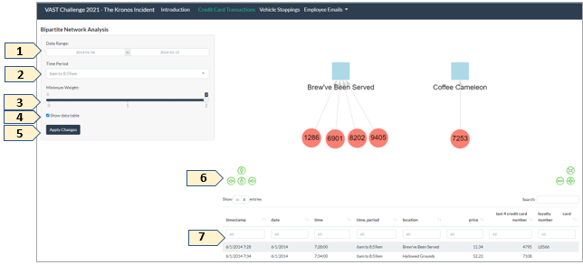
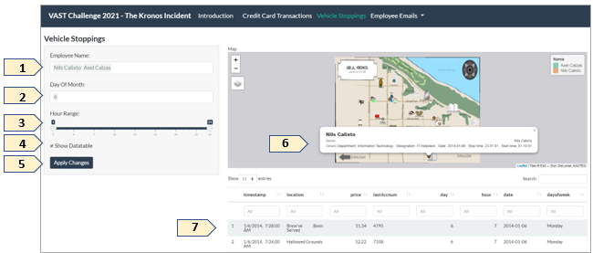
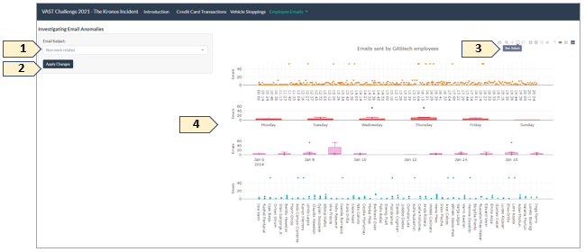
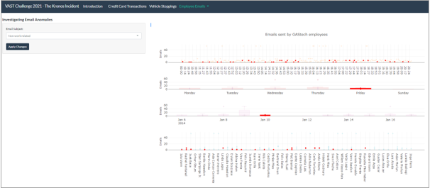

# User Guide: A Visual Exploration for VAST Challenge 2021 - The Kronos Incident

An detailed User Guide is prepared to help get the end users started on using the Shiny application. The User Guide can be viewed in **[pdf](UserGuideDoc/UserGuide.pdf)** format as well.

## 1. Introduction

The Shiny Application’s description, overview of the case and brief introduction of the visualizations are included on this page.

***

## 2. Credit Card Transactions

With reference to Figure 1,

1)	Select desired **date range** to visualize the credit card transactions of GAStech employees at their respective locations. The date range has been set to include only the min and max date of the data. The numbers in the red circles represent the last 4 credit card numbers. 

2)	Select the desired **time period** to filter the visualization by a specific time period. 

3)	Select the desired **weight**. The weight here represents the minimum number of times that a particular credit card was used at the same location.

4)	The “**show data table**” option allows user to decide if they want to view or hide the data table. 

5)	Select “**Apply Changes**” to generate the Bipartite Network Graph for the credit card transactions. 

6)	The **navigation buttons** allow user to have graph navigation functions, moving the graph in their desired direction for more focus. User can also move the nodes with the connections preserved in this graph for added interactivity. 

7)	The **data table** is provided for end user to easily refer to the details of the credit card usage and purchase, loyalty number at the respective time and place. The ‘top’ filter under the header row of the data table allows end user to easily filter desired information.

***

## 3. Vehicle Stoppings

With reference to Figure 2,

1)	Select desired **employee name** via the drop-down list. The employees’ car stopping locations will appear on the map and the colors are shown in the legend. Multiple selections are possible and each employee will have a different color for easy identification on the map. 

2)	Select **day of month** via the drop down. Multiple selections are also possible and will filter the visualization to show car stoppings on the selected days in January 2014. 

3)	Select the **hour range** via the sliderinput. This filters visualization to include only selected hour range. 

4)	The “**show data table**” option allows user to decide if they want to view or hide the data table. 

5)	Select “**Apply Changes**” to generate the tmap graph for the vehicle stopping locations.

6)	Click on the node to see the **tooltip** which provides information about details about the employee and his/her vehicle movement (department, designation and start time, stop time and date).  

7)	The **data table** is provided for user to enable them to compare the credit card usage at specific locations against the vehicle stopping of employees in the tmap, allowing the user to be able to infer who the credit cards might belong to. The ‘top’ filter under the header row of the data table allows end user to easily filter desired information.

***

## 4. Employee Emails – Investigating Email Anomalies

With reference to Figures 3 and 4,

1)	Select **email subject** via the drop-down list. The emails are categorized into work-related or non-work related email subjects. 

2)	Select “**Apply Changes**” to generate the Plotly graph visualization for the emails sent by GAStech employees. 

3)	All subplots are linked so user can perform **brushing** of selected data and the connections will appear in all other subplots. 

4)	When user **hover** over the **Plotly figure**, a **modebar** appears in the top-right of the figure and presents user with several options for interacting with the figure such as "Lasso select" to select areas of the graph in lasso format.

***

## 5. Employee Emails – Understanding Relationships

With reference to Figures 5 and 6,

1A)	Select targeted employee via the **focus on their employee ID** drop-down list and the image will zoom into the selected node after “**Apply Changes**” is selected. 

1B) Table 1 which is linked to the selected employee node will also update to reflect employee details of the corresponding employee ID. 

2)	Select **subject** via the drop-down list. The emails are categorized into work-related or non-work-related types.

3)	Select **email sent hour** via the drop-down list. The email sent hour is categorized into during work hours and after work hours. 

4)	Select desired **date range** via the date range input to visualize the credit card transactions of GAStech employees at their respective locations. The date range has been set to include only the min and max date of the data. 

5)	Select the **minimum emails exchanged** via the sliderinput. 

6)	Select “**Apply Changes**” to generate the visNetwork graph visualization for the emails sent among GAStech employees. 

7)	Refer to the employee name indicated in Table 1 and select the same **employee** name via the drop-down list to highlight the employee’s nearest neighbors. These nearest neighbors are colleagues whom the employee exchanged emails with under the user’s selected conditions.  

8)	Select the **community** via the drop-down list if user desires to examine the specific communities calculated via the cluster_label_prop algorithm for the respective filtered fields.

9)	The **navigation buttons** allow user to have graph navigation functions, moving the graph in their desired direction for more focus. User can also move the nodes with the connections preserved in this graph for added interactivity. 

10)	Employees that are more influential are represented by bigger nodes and thicker arrows represent more emails sent between the nodes (employees). 

11)	The **data table** is provided for user to get more details about the emails sent between the selected employees and his/her recipients/sender. It contains information about the sender’s name, recipient’s name, email subject title, email subject type and datetime details of emails sent. The ‘top’ filter under the header row of the data table allows end user to easily filter desired information.