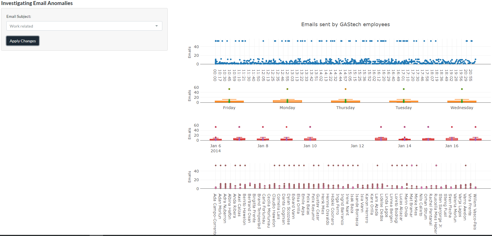

# Introduction 
With the pressing time urgency in solving crimes, it is necessary to maximize the use of analytics tools to enhance the law enforcers’ abilities to pick up hints and clues in order to speed up their investigation and to close the case. The R packages for data analytics provide an excellent tool for analysts to customize various visualizations according to the business use cases. The R packages share an underlying design philosophy, grammar, and data structures and this strong advantage allows analysts to combine various functionalities of different packages in an integrated manner.

# Motivation of the application
The motivation behind this application is driven by the need for an efficient end-to-end environment of data pre-processing, data visualization creation and analysis as well as to host the visualizations on a web browser for the end users’ convenient use, allowing them to perform further what-if analysis, manipulating parameters to see the impact of different approaches/perspectives without a coding background prerequisite. Shiny is an R package for developing interactive web applications and its benefits include ease-of-use, diversity, shareability and elegant design. It also makes development work more efficient especially since it has high reproducibility as end users can easily replicate or make tweaks with the source code. Shiny is also open source which reduces the barrier of entry for new users who would want access to a visualization tool that allows them to customize visualizations. 

Our research and development efforts for this Shiny application were motivated by the interactive and user-friendly web-enabled client-based visual analytics tool to aid in the identification of anomalies, suspicious behaviours and patterns. The Shiny web application built for the analysis is highly customisable and easy to use with user interactivity on visualizations. It aims to provide the law enforcement agencies in Kronos and Tethys with an analytic tool for discovering visual behaviours and patterns of the network relationships in emails, credit card transactions and car movement paths. Specifically, it supports the following analysis:

* To perform community visualization by creating a bipartite network analysis of the credit card transaction data to understand the relationship between the credit cards and the merchants.

*	To create visualizations on the stationary points using the vehicle tracking data to uncover the formal/informal relationships among the employees and to map the employees to their corresponding credit cards.

# Review and Critic on Past Work
There have been some existing network visualizations using R performed with the same GAStech employees’ email dataset but there are still room for improvement especially in utilizing or integrating more functionalities of R packages.

For the review on community detection network visualization (Figure 1) there was no label to indicate the identity of each node (employee) and no label to explain the meaning of the colors. On the other hand, Figure 2’s community detection network visualization contains labels which aid in the understanding of the identification of each node (employee) and a legend to explain the meaning of the colors. The edge link also retained their color after the node have been selected which could be confusing for users as there are too many lines that are not directly related to the nodes and nearest neighbors.

Both of the visualizations shown in Figure 1 and Figure 2 above did not provide other filter functions for the end users which would have otherwise allowed the end users more flexibility in zooming in on targeted analysis that they would like to perform.

A research paper by Seal & Wild @sealwild2018 looked at the visualization of network plots using Shiny application. The application had a module on the network properties of the bipartite network graph such as modes, density, compute centrality measures such as degree, density, betweenness of the nodes and total number of interactions (Figure 3). This is useful to the users to help understand the centrality measures that will aid in their decision making and the visualization of the bipartite network graph.

The application also contains a network plot module (Figure 4) using the visNetwork package. The true interactions are denoted by the bold lines while the predicted interactions are displayed in dashed lines with drop down lists provided to select specific nodes and groups. Although this network plot is useful to show the network, the layout of the network visualization could be further improved to better show the bipartite relationship of the data using the bipartite network layout since the dataset used is a two-projected (bipartite) network of drugs and proteins. In view of this problem, we research to explore alternative visualization methods to analyze the bipartite network data in our credit card transactions dataset which contains the credit card numbers and the locations. A good visualization method will be using the bipartite-specific layout of the igraph package (Figure 5) to better visualize and represent the network that makes it easier to understand and incorporating features to draw interest.

Youssef et al. @youssefetal2019 utilizes the leaflet package to visualize and analyse the movement of the horseshoe crabs. Shiny application is used to give the users the control to look at the chart view and map view of the crab movements. There is also an slider bar present to specify the year range and a dropdown to select the gender (Figure 6).

The movement path analysis in Youssef et al. @youssefetal2019 application utilizing the leaflet package to display the trajectory of crabs from the source location to destination over years. The trajectory of the horseshoe crabs is plotted with red and blue circles denoting the initial and final locations with line connecting them to show the path (Figure 7). Though insightful, it can be improved further by enabling the multiple selections for source location and destination location so that the users can get a wide variety of options to analyze the movement path rather than doing a one-way analysis. The tooltip functionality could have been used effectively to show the year and gender by hovering through the red and blue circles to see if there are any patterns. In addition, the overlap of the points can also be distinguished to an extent by adding transparency the circles denoting source/destination locations.

# Design Framework
With inspiration from the paper by Kam et al. @kametal2012, ‘DIVAD: A Dynamic and Interactive Visual Analytical Dashboard for Exploring and Analyzing Transport Data’ of its applicationa use of Shneiderman’s Mantra @shneiderman1996, an influential organizing principle for the creation of visualization systems, we utilized the same principle for our design:

* 1. Overview First

* 2. Zoom and Filter

* 3. Details on Demand

The overview step is to have an overview of all employees and their interactions over the entire two weeks (the data available).  Immediately, we see that Matt Bramar, assistant to the CEO sends emails to all employees in the company and his large size represents that he is very influential (Figure 8). The node sizes are a reflection of the nodes’ eigenvector centrality. Eigenvector centrality measures a node’s importance while giving consideration to the importance of its neighbors and a person with few connections could have a very high eigenvector centrality if those few connections were to very well-connected others. Goldbeck @goldbeck2013 postulates its usage in measuring a node’s influence in the network. The same design principle is also applied to the Bipartite Network Analysis plot and the Movement Path Analysis plot where it gives an overview of the credit card transactions relationship with the locations (Figure 9) and the movement path of the selected employees (Figure 10) respectively based on the selected inputs.

The employee name can be selected to help the end user focus on certain employee to visualize the relationship and the employee name input has been sorted in alphabetical order (Figure 11).

# References

---
references:
- id: gaoyu2020
  title: "In-class exercise 11: Network"
  author:
  - family: Gao
    given: Yu
  type: article-journal
  issued:
    year: 2020
    month: 4
  URL: "https://rpubs.com/YGAO359/network"
- id: christine2019
  title: "IS428 Data Visualization Makeover2 Christine"
  author:
  - given: Christine
  type: article-journal
  issued:
    year: 2019
    month: 11
  URL: "https://rpubs.com/Christine2016/IS428_Makeover2_Christine"
- id: sealwild2018
  title: "Netpredictor: R and Shiny package to perform drug-target network analysis and prediction of missing links"
  author:
  - family: Seal
    given: Abhik
  - family: Wild
    given: David J.
  container-title: BMC Bioinformatics
  volume: 19
  URL: "https://doi.org/10.1186/s12859-018-2254-7"
  issue: 265
  type: article-journal
  issued:
    year: 2018
    month: 7
- id: youssefetal2019
  title: "An R Analytics Tool to Visualize and Analyze the Movement of Horseshoe Crabs in Long Island Sound"
  author:
  - family: Youssef
    given: Ismael
  - family: Senbel
    given: Samah
  - family: Kasinak
    given: Jo-Marie Elisha
  - family: Mattei
    given: Jennifer
  container-title: 2019 IEEE Long Island Systems, Applications and Technology Conference (LISAT)
  URL: "https://doi.org/10.1109/lisat.2019.8817346"
  publisher: IEEE
  type: article-journal
  issued:
    year: 2019
    month: 5
- id: kametal2012
  title: "DIVAD: A Dynamic and Interactive Visual Analytical Dashboard for Exploring and Analyzing Transport Data"
  author:
  - family: Kam
    given: Tin Seong
  - family: Barshikar
    given: Ketan
  - family: Tan
    given: Shaun Jun Hua
  container-title: International Journal of Computer, Electrical, Automation, Control and Information Engineering
  volume: 6
  URL: "https://ink.library.smu.edu.sg/sis_research/1761/"
  issue: 11
  publisher: World Academy of Science, Engineering and Technology
  type: article-journal
  year: 2012
  month: 11
- id: shneiderman1996
  title: "The Eyes Have It: A Task by Data Type Taxonomy for Information Visualizations"
  author:
  - family: Shneiderman
    given: Ben
  container-title: Proceedings 1996 IEEE Symposium on Visual Languages
  URL: "https://ieeexplore.ieee.org/document/545307"
  publisher: IEEE
  type: article-journal
  year: 1996
  month: 9
- id: goldbeck2013
  title: "Chapter 3 - Network Structure and Measures"
  author:
  - family: Goldbeck
    given: Jennifer
  container-title: In Analyzing the Social Web
  URL: "https://doi.org/10.1016/b978-0-12-405531-5.00003-1"
  publisher: Elsevier Inc.
  page: 25-44
  type: article-journal
  issued:
    year: 2013
- id: meier2012
  title: Professinal Android 4 Application Development
  author: 
  - family: Meier
    given: Reto
  type: webpage
  publisher: John Wiley & Sons, Inc.
  issued:
    year: 2012
    month: 5
- id: fenner2012a
  title: One-click science marketing
  author:
  - family: Fenner
    given: Martin
  container-title: Nature Materials
  volume: 11
  URL: 'https://doi.org/10.1038/nmat3283'
  DOI: 10.1038/nmat3283
  issue: 4
  publisher: Nature Publishing Group
  page: 261-263
  type: article-journal
  issued:
    year: 2012
    month: 3
...

